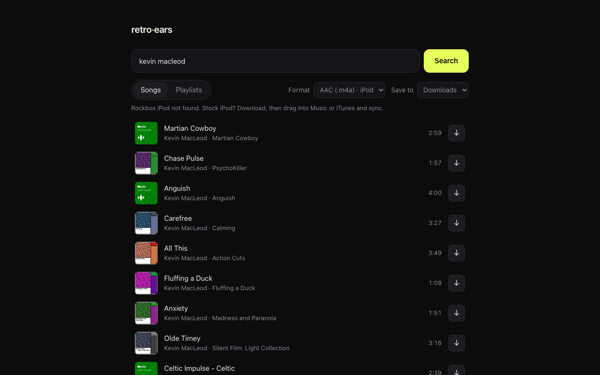
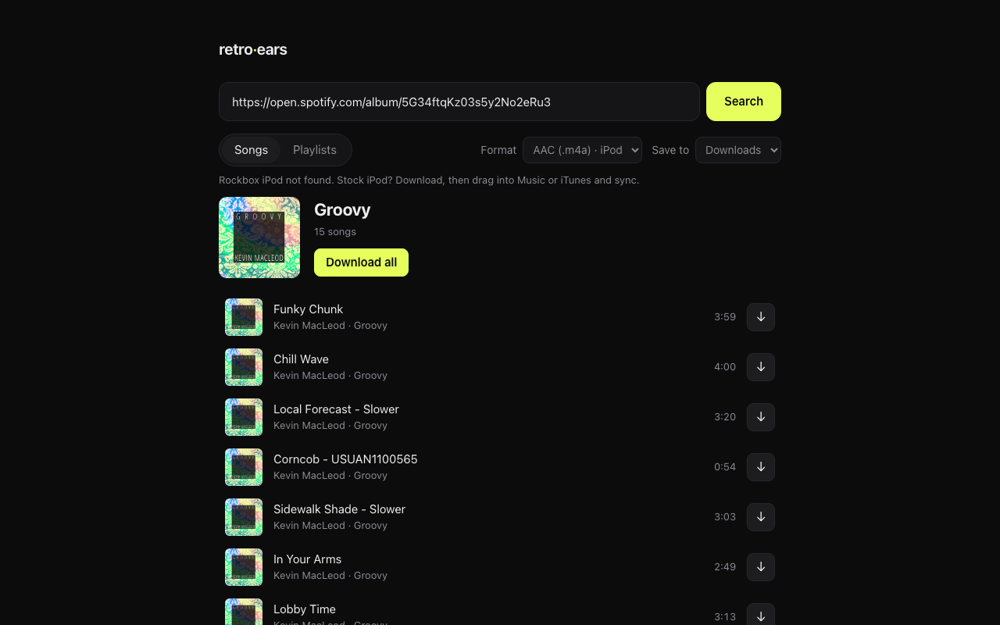

# retro-ears

Search songs and playlists — or paste a YouTube, YouTube Music, Spotify or Apple Music link — and get music ready for your iPod, with title, artist, album and cover art built in. Works with stock iPods and Rockbox.



**[Download retro-ears](https://github.com/kandooswill/retro-ears/releases/latest)** — free, for macOS and Windows.

## Quick start

### macOS

1. Download **retro-ears-mac.zip** from the [latest release](https://github.com/kandooswill/retro-ears/releases/latest) and double-click it to unzip.
2. Open the **retro-ears** folder and double-click **Start retro-ears.command**.
   - The first time, macOS says it can't verify the app. Click **Done**, open **System Settings → Privacy & Security**, scroll down, click **Open Anyway** next to "Start retro-ears.command", and confirm. You only do this once.
3. A Terminal window sets things up (1–2 minutes the first time), then retro-ears opens in your browser. Keep that window open while you use retro-ears; close it to quit.

### Windows

1. Download **retro-ears-windows.zip** from the [latest release](https://github.com/kandooswill/retro-ears/releases/latest), right-click it and choose **Extract All**.
2. Open the **retro-ears** folder and double-click **Start retro-ears.bat**.
   - If you see "Windows protected your PC", click **More info → Run anyway**. (Or, before extracting, right-click the zip → **Properties** → tick **Unblock**.)
3. A black window sets things up (1–2 minutes the first time), then your browser opens. Keep that window open; close it to quit.

There's nothing else to install: retro-ears downloads its own copy of Python into its folder.

## Using it

- Type a song or artist, or switch to **Playlists**. You can also paste a link.
- Pick a **Format**, then click **↓** next to a song, or **Download all** on a playlist (playlists arrive as one ZIP).



## Getting music onto your iPod

- **Stock iPod (Apple software):** choose **AAC (.m4a)**. Drag the downloaded files into the Music app (macOS) or iTunes / Apple Music (Windows), then sync your iPod.
- **Rockbox iPod:** plug it in and within a few seconds it appears under **Save to**. Pick it and songs are copied straight to `Music/Artist/Album/` with cover art. Eject the iPod before unplugging it. Windows can't read Mac-formatted iPods; Rockbox iPods are usually formatted FAT32 and work on both.

## Formats

| Format | What you get | Best for |
|---|---|---|
| **AAC (.m4a)** | YouTube's own AAC audio, not converted (about 130 kbps) | Stock iPod |
| **Opus** | YouTube's own Opus audio, not converted (about 130 kbps) | Rockbox |
| **MP3 320** | Converted from the best stream — plays anywhere, but isn't better than the source | Everything else |

Each finished song shows the quality it actually got.

## Updating

- **Downloads suddenly failing?** YouTube probably changed something. Click **Update yt-dlp** at the bottom of the page; retro-ears updates and restarts itself.
- **New retro-ears version?** A banner at the top links to it. Download the new zip and replace your old folder; the first start sets up again.

## FAQ

**Why about 130 kbps?** That's the best YouTube serves without its paid, bot-protected streams. High-resolution videos carry the same audio, and converting to MP3 320 can't add detail back.

**Can I use my YouTube Premium account for better quality?** No. Premium's 256 kbps streams need tokens that retro-ears doesn't generate.

**Why does a Spotify playlist stop at 100 songs?** Spotify's public page only lists the first 100.

**How do I uninstall?** Delete the retro-ears folder. Everything lives inside it.

**Is it safe to run?** retro-ears only runs on your own computer (`127.0.0.1`) and refuses connections from anywhere else.

## Troubleshooting

- **"Setup failed — check your internet connection and try again"** — the first start needs internet to fetch Python and packages. Connect and start again.
- **"Port 8787 is in use by another program"** — close the program using that port, or restart your computer.
- **My iPod isn't listed under Save to** — only Rockbox iPods (with a `.rockbox` folder) appear. Stock iPods sync through Music or iTunes.
- **Antivirus complains about uv.exe** — it's [uv](https://github.com/astral-sh/uv), the official tool retro-ears uses to install Python. Allow it.
- **Downloads fail** — click **Update yt-dlp**.

## Personal use

retro-ears is for personal use. You're responsible for what you download and for following copyright law and YouTube's terms. Screenshots show music by Kevin MacLeod ([incompetech.com](https://incompetech.com)), licensed CC BY 4.0.

## Development

```bash
uv sync
uv run pytest                   # offline tests
uv run pytest -m live -s        # real downloads of Creative Commons tracks
bash "Start retro-ears.command"  # macOS launcher (uses uv from PATH in a git clone)
```

To release: set the new version in `VERSION` and `pyproject.toml`, commit, then `git tag vX.Y.Z && git push origin vX.Y.Z`. GitHub Actions tests, builds both zips and publishes the release.

## License

[GPL-3.0](LICENSE)
